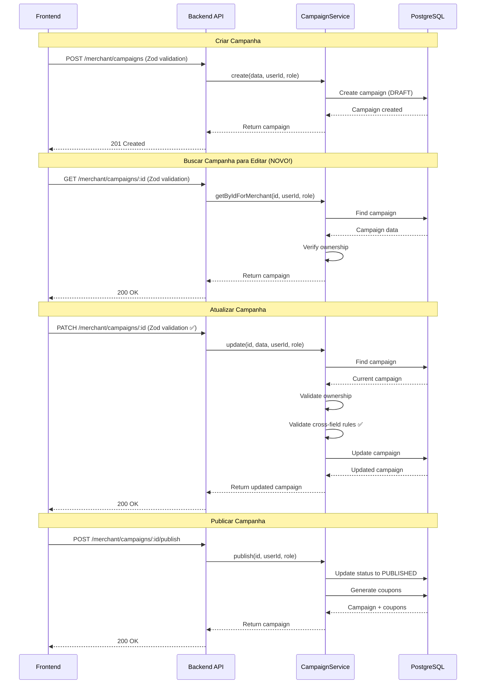

# Correções para Endpoints de Campanhas - Código Pronto

Este documento contém o código completo e pronto para aplicar as correções identificadas no relatório de investigação.

---

## Correção #1: Adicionar Validação Zod no Endpoint PATCH

**Prioridade:** CRÍTICA
**Tempo:** 5 minutos
**Arquivo:** `backend/src/routes/merchant.ts`

### Alterações Necessárias

#### 1.1. Adicionar Import do Schema (Linha 4)

```typescript
// backend/src/routes/merchant.ts
import { Router } from 'express';
import { authenticate, authorize } from '@/middlewares/auth';
import { validate } from '@/middlewares/validate';
import { campaignSchemas } from '@/schemas/campaign.schema'; // ✅ ADICIONAR ESTA LINHA
import { AuthRequest } from '@/middlewares/auth';
import { Response, NextFunction } from 'express';
import { campaignService } from '@/services/CampaignService';
import { UserRole } from '@prisma/client';
```

#### 1.2. Remover Schema Inline (Linhas 15-34)

```typescript
// ❌ REMOVER TODO ESTE BLOCO:
const createCampaignSchema = z.object({
  body: z.object({
    merchantId: z.string().uuid(),
    title: z.string().min(5),
    description: z.string().min(20),
    shortDescription: z.string().optional(),
    priceOriginal: z.number().positive(),
    pricePromo: z.number().positive(),
    category: z.string(),
    tags: z.array(z.string()).optional(),
    city: z.string(),
    state: z.string(),
    startAt: z.string().datetime(),
    endAt: z.string().datetime(),
    totalQuantity: z.number().int().positive(),
    terms: z.string().optional(),
    imageUrl: z.string().url().optional(),
    images: z.array(z.string().url()).optional(),
  }),
});
```

#### 1.3. Atualizar Rota POST para Usar Schema Centralizado (Linha 37-40)

```typescript
// backend/src/routes/merchant.ts:37-61
router.post(
  '/campaigns',
  authorize(UserRole.MERCHANT, UserRole.ADMIN),
  validate(campaignSchemas.create), // ✅ ALTERAR: usar schema centralizado
  async (req: AuthRequest, res: Response, next: NextFunction) => {
    try {
      const campaign = await campaignService.create(
        {
          ...req.body,
          startAt: new Date(req.body.startAt),
          endAt: new Date(req.body.endAt),
        },
        req.user!.userId,
        req.user!.role,
      );

      res.status(201).json({
        status: 'success',
        data: campaign,
      });
    } catch (error) {
      next(error);
    }
  },
);
```

#### 1.4. Adicionar Validação no PATCH (Linha 64-66)

```typescript
// backend/src/routes/merchant.ts:64-84
router.patch(
  '/campaigns/:id',
  authorize(UserRole.MERCHANT, UserRole.ADMIN),
  validate(campaignSchemas.update), // ✅ ADICIONAR ESTA LINHA
  async (req: AuthRequest, res: Response, next: NextFunction) => {
    try {
      const campaign = await campaignService.update(
        req.params.id,
        req.body,
        req.user!.userId,
        req.user!.role,
      );

      res.status(200).json({
        status: 'success',
        data: campaign,
      });
    } catch (error) {
      next(error);
    }
  },
);
```

### Teste Manual

```bash
# Testar validação com dados inválidos
curl -X PATCH http://localhost:3000/api/merchant/campaigns/YOUR_CAMPAIGN_ID \
  -H "Authorization: Bearer YOUR_TOKEN" \
  -H "Content-Type: application/json" \
  -d '{
    "title": "AB",
    "pricePromo": 999,
    "priceOriginal": 100
  }'

# Esperado: 400 Bad Request
# {
#   "status": "error",
#   "message": "Validation error",
#   "errors": [
#     {
#       "field": "body.title",
#       "message": "Título muito curto"
#     },
#     {
#       "field": "body.pricePromo",
#       "message": "Preço promocional deve ser menor que o preço original"
#     }
#   ]
# }
```

---

## Correção #2: Criar Endpoint GET Individual

**Prioridade:** ALTA
**Tempo:** 1 hora
**Arquivos:** `backend/src/services/CampaignService.ts`, `backend/src/routes/merchant.ts`

### 2.1. Adicionar Método no CampaignService

```typescript
// backend/src/services/CampaignService.ts
// ADICIONAR após o método getById (linha ~162)

/**
 * Get campaign by ID with merchant ownership verification
 */
async getByIdForMerchant(id: string, userId: string, userRole: UserRole) {
  // Buscar campanha
  const campaign = await this.getById(id, false);

  // Verificar ownership apenas para merchants (admins podem ver tudo)
  if (userRole !== UserRole.ADMIN) {
    const merchant = await prisma.merchant.findUnique({
      where: { userId },
    });

    if (!merchant) {
      throw new ForbiddenError('Merchant profile not found');
    }

    if (campaign.merchantId !== merchant.id) {
      throw new ForbiddenError('Você não tem permissão para acessar esta campanha');
    }
  }

  return campaign;
}
```

### 2.2. Adicionar Rota GET em Merchant

```typescript
// backend/src/routes/merchant.ts
// ADICIONAR após a rota POST de criação (após linha 61, ANTES do PATCH)

/**
 * Get campaign by ID (merchant-specific with ownership check)
 * GET /api/merchant/campaigns/:id
 */
router.get(
  '/campaigns/:id',
  authorize(UserRole.MERCHANT, UserRole.ADMIN),
  validate(campaignSchemas.getById),
  async (req: AuthRequest, res: Response, next: NextFunction) => {
    try {
      const campaign = await campaignService.getByIdForMerchant(
        req.params.id,
        req.user!.userId,
        req.user!.role,
      );

      res.status(200).json({
        status: 'success',
        data: campaign,
      });
    } catch (error) {
      next(error);
    }
  },
);
```

### Posicionamento Correto das Rotas

**IMPORTANTE:** A ordem das rotas deve ser:

```typescript
// backend/src/routes/merchant.ts - ORDEM CORRETA

router.use(authenticate);

// 1. POST - Criar campanha
router.post('/campaigns', ...);

// 2. GET :id - Buscar campanha específica (ANTES de GET sem parâmetro!)
router.get('/campaigns/:id', ...);

// 3. GET - Listar campanhas (DEPOIS de rotas com parâmetros!)
router.get('/campaigns', ...);

// 4. PATCH - Atualizar campanha
router.patch('/campaigns/:id', ...);

// 5. POST publish - Publicar campanha
router.post('/campaigns/:id/publish', ...);

// 6. DELETE - Deletar campanha
router.delete('/campaigns/:id', ...);
```

### Teste Manual

```bash
# Teste 1: Buscar própria campanha (deve retornar 200)
curl -X GET http://localhost:3000/api/merchant/campaigns/YOUR_CAMPAIGN_ID \
  -H "Authorization: Bearer YOUR_TOKEN"

# Esperado: 200 OK com dados da campanha

# Teste 2: Buscar campanha de outro merchant (deve retornar 403)
curl -X GET http://localhost:3000/api/merchant/campaigns/OTHER_MERCHANT_CAMPAIGN_ID \
  -H "Authorization: Bearer YOUR_TOKEN"

# Esperado: 403 Forbidden
# {
#   "status": "error",
#   "message": "Você não tem permissão para acessar esta campanha"
# }

# Teste 3: Admin pode buscar qualquer campanha (deve retornar 200)
curl -X GET http://localhost:3000/api/merchant/campaigns/ANY_CAMPAIGN_ID \
  -H "Authorization: Bearer ADMIN_TOKEN"

# Esperado: 200 OK
```

---

## Correção #3: Validação Cross-Field no Service

**Prioridade:** MÉDIA
**Tempo:** 1 hora
**Arquivo:** `backend/src/services/CampaignService.ts`

### Código Completo do Método Update (Refatorado)

```typescript
// backend/src/services/CampaignService.ts:254-296
/**
 * Update campaign
 */
async update(id: string, data: UpdateCampaignData, userId: string, userRole: UserRole) {
  const campaign = await prisma.campaign.findUnique({
    where: { id },
    include: { merchant: true },
  });

  if (!campaign) {
    throw new NotFoundError('Campaign not found');
  }

  if (campaign.merchant.userId !== userId && userRole !== UserRole.ADMIN) {
    throw new ForbiddenError('You do not have permission to update this campaign');
  }

  // ✅ ADICIONAR: Prevent updates to published campaigns (except admin)
  if (
    campaign.status === CampaignStatus.PUBLISHED &&
    userRole !== UserRole.ADMIN
  ) {
    throw new BadRequestError(
      'Não é possível editar campanhas já publicadas. Entre em contato com o suporte.',
    );
  }

  // ✅ ADICIONAR: Validar preços (cross-field com valores existentes)
  const newPriceOriginal = data.priceOriginal ?? Number(campaign.priceOriginal);
  const newPricePromo = data.pricePromo ?? Number(campaign.pricePromo);

  if (newPricePromo >= newPriceOriginal) {
    throw new BadRequestError(
      'Preço promocional deve ser menor que o preço original',
    );
  }

  // ✅ ADICIONAR: Validar datas (cross-field com valores existentes)
  const newStartAt = data.startAt ?? campaign.startAt;
  const newEndAt = data.endAt ?? campaign.endAt;

  if (new Date(newEndAt) <= new Date(newStartAt)) {
    throw new BadRequestError(
      'Data de término deve ser posterior à data de início',
    );
  }

  // ✅ ADICIONAR: Validar quantidade total (não pode diminuir se já tem cupons resgatados)
  if (
    data.totalQuantity !== undefined &&
    data.totalQuantity < campaign.redeemedQuantity
  ) {
    throw new BadRequestError(
      `Quantidade total não pode ser menor que cupons já resgatados (${campaign.redeemedQuantity})`,
    );
  }

  // Calcular novo desconto
  const discountPercent = Math.round(
    ((newPriceOriginal - newPricePromo) / newPriceOriginal) * 100,
  );

  const updated = await prisma.campaign.update({
    where: { id },
    data: {
      ...data,
      discountPercent,
    },
    include: {
      merchant: {
        select: {
          id: true,
          name: true,
          city: true,
          state: true,
          logoUrl: true,
        },
      },
    },
  });

  return updated;
}
```

### Validações Adicionadas

1. **Proteção de campanhas publicadas**: Merchants não podem editar campanhas publicadas (apenas admins)
2. **Validação de preços**: `pricePromo` deve sempre ser menor que `priceOriginal` (mesmo em updates parciais)
3. **Validação de datas**: `endAt` deve sempre ser posterior a `startAt` (mesmo em updates parciais)
4. **Validação de quantidade**: Não pode diminuir `totalQuantity` abaixo de cupons já resgatados

### Testes Unitários

```typescript
// backend/src/__tests__/services/CampaignService.test.ts

import { describe, it, expect, beforeEach } from 'vitest';
import { campaignService } from '@/services/CampaignService';
import { UserRole, CampaignStatus } from '@prisma/client';
import { BadRequestError, ForbiddenError } from '@/utils/errors';

describe('CampaignService.update - Validações Cross-Field', () => {
  let campaignId: string;
  let merchantUserId: string;

  beforeEach(async () => {
    // Setup: criar campanha de teste
    // ... (código de setup)
  });

  it('should reject update with pricePromo >= priceOriginal', async () => {
    await expect(
      campaignService.update(
        campaignId,
        { pricePromo: 100 },
        merchantUserId,
        UserRole.MERCHANT,
      ),
    ).rejects.toThrow(BadRequestError);
  });

  it('should reject update with endAt <= startAt', async () => {
    await expect(
      campaignService.update(
        campaignId,
        { endAt: new Date('2025-01-01') }, // Anterior ao startAt original
        merchantUserId,
        UserRole.MERCHANT,
      ),
    ).rejects.toThrow(BadRequestError);
  });

  it('should reject update of published campaign by merchant', async () => {
    // Publicar campanha
    await campaignService.publish(campaignId, merchantUserId, UserRole.MERCHANT);

    // Tentar atualizar
    await expect(
      campaignService.update(
        campaignId,
        { title: 'Novo Título' },
        merchantUserId,
        UserRole.MERCHANT,
      ),
    ).rejects.toThrow(BadRequestError);
  });

  it('should allow admin to update published campaign', async () => {
    // Publicar campanha
    await campaignService.publish(campaignId, merchantUserId, UserRole.MERCHANT);

    // Admin pode atualizar
    const updated = await campaignService.update(
      campaignId,
      { title: 'Título Atualizado pelo Admin' },
      'admin-user-id',
      UserRole.ADMIN,
    );

    expect(updated.title).toBe('Título Atualizado pelo Admin');
  });

  it('should reject totalQuantity less than redeemed coupons', async () => {
    // Simular 10 cupons resgatados
    // ... (código de setup)

    await expect(
      campaignService.update(
        campaignId,
        { totalQuantity: 5 }, // Menor que 10 resgatados
        merchantUserId,
        UserRole.MERCHANT,
      ),
    ).rejects.toThrow(BadRequestError);
  });
});
```

---

## Correção #4: MerchantController (Opcional)

**Prioridade:** BAIXA
**Tempo:** 3 horas
**Arquivos:** `backend/src/controllers/MerchantController.ts` (novo), `backend/src/routes/merchant.ts`

### 4.1. Criar MerchantController

```typescript
// backend/src/controllers/MerchantController.ts (NOVO ARQUIVO)
import { Response, NextFunction } from 'express';
import { campaignService } from '@/services/CampaignService';
import { AuthRequest } from '@/types';
import { BaseController } from './BaseController';

/**
 * Merchant Controller
 *
 * Handles merchant-specific campaign management endpoints including:
 * - Create, update, delete campaigns
 * - Publish campaigns
 * - List merchant campaigns
 * - Get campaign details with ownership verification
 */
export class MerchantController extends BaseController {
  /**
   * Create campaign
   * POST /api/merchant/campaigns
   */
  async createCampaign(
    req: AuthRequest,
    res: Response,
    next: NextFunction,
  ): Promise<void> {
    await this.execute(
      async () => {
        const campaign = await campaignService.create(
          {
            ...req.body,
            startAt: new Date(req.body.startAt),
            endAt: new Date(req.body.endAt),
          },
          this.getUserId(req),
          this.getUserRole(req),
        );

        this.created(res, campaign);
        this.logAction(req, 'create_campaign', { campaignId: campaign.id });
      },
      req,
      res,
      next,
    );
  }

  /**
   * Get campaign by ID (with ownership verification)
   * GET /api/merchant/campaigns/:id
   */
  async getCampaign(
    req: AuthRequest,
    res: Response,
    next: NextFunction,
  ): Promise<void> {
    await this.execute(
      async () => {
        const { id } = req.params;

        const campaign = await campaignService.getByIdForMerchant(
          id,
          this.getUserId(req),
          this.getUserRole(req),
        );

        this.success(res, campaign);
      },
      req,
      res,
      next,
    );
  }

  /**
   * Update campaign
   * PATCH /api/merchant/campaigns/:id
   */
  async updateCampaign(
    req: AuthRequest,
    res: Response,
    next: NextFunction,
  ): Promise<void> {
    await this.execute(
      async () => {
        const { id } = req.params;

        const campaign = await campaignService.update(
          id,
          req.body,
          this.getUserId(req),
          this.getUserRole(req),
        );

        this.success(res, campaign);
        this.logAction(req, 'update_campaign', { campaignId: id });
      },
      req,
      res,
      next,
    );
  }

  /**
   * Publish campaign
   * POST /api/merchant/campaigns/:id/publish
   */
  async publishCampaign(
    req: AuthRequest,
    res: Response,
    next: NextFunction,
  ): Promise<void> {
    await this.execute(
      async () => {
        const { id } = req.params;

        const campaign = await campaignService.publish(
          id,
          this.getUserId(req),
          this.getUserRole(req),
        );

        this.success(res, campaign);
        this.logAction(req, 'publish_campaign', { campaignId: id });
      },
      req,
      res,
      next,
    );
  }

  /**
   * Delete campaign
   * DELETE /api/merchant/campaigns/:id
   */
  async deleteCampaign(
    req: AuthRequest,
    res: Response,
    next: NextFunction,
  ): Promise<void> {
    await this.execute(
      async () => {
        const { id } = req.params;

        await campaignService.delete(
          id,
          this.getUserId(req),
          this.getUserRole(req),
        );

        this.success(res, { message: 'Campanha deletada com sucesso' });
        this.logAction(req, 'delete_campaign', { campaignId: id });
      },
      req,
      res,
      next,
    );
  }

  /**
   * List merchant campaigns
   * GET /api/merchant/campaigns
   */
  async listCampaigns(
    req: AuthRequest,
    res: Response,
    next: NextFunction,
  ): Promise<void> {
    await this.execute(
      async () => {
        const { merchantId, status } = req.query;

        const result = await campaignService.list({
          merchantId: merchantId as string,
          status: status as any,
          page: req.query.page ? parseInt(req.query.page as string) : undefined,
          limit: req.query.limit ? parseInt(req.query.limit as string) : undefined,
        });

        this.paginated(res, result.campaigns, result.pagination);
      },
      req,
      res,
      next,
    );
  }
}

export const merchantController = new MerchantController();
```

### 4.2. Refatorar Routes para Usar Controller

```typescript
// backend/src/routes/merchant.ts (VERSÃO REFATORADA COMPLETA)
import { Router } from 'express';
import { authenticate, authorize } from '@/middlewares/auth';
import { validate } from '@/middlewares/validate';
import { campaignSchemas } from '@/schemas/campaign.schema';
import { merchantController } from '@/controllers/MerchantController';
import { UserRole } from '@prisma/client';

const router = Router();

// All merchant routes require authentication
router.use(authenticate);

/**
 * Campaign Management Routes
 */

// Create campaign
router.post(
  '/campaigns',
  authorize(UserRole.MERCHANT, UserRole.ADMIN),
  validate(campaignSchemas.create),
  merchantController.createCampaign.bind(merchantController),
);

// Get campaign by ID (with ownership check)
router.get(
  '/campaigns/:id',
  authorize(UserRole.MERCHANT, UserRole.ADMIN),
  validate(campaignSchemas.getById),
  merchantController.getCampaign.bind(merchantController),
);

// List campaigns (merchant-specific)
router.get(
  '/campaigns',
  authorize(UserRole.MERCHANT, UserRole.ADMIN),
  validate(campaignSchemas.list),
  merchantController.listCampaigns.bind(merchantController),
);

// Update campaign
router.patch(
  '/campaigns/:id',
  authorize(UserRole.MERCHANT, UserRole.ADMIN),
  validate(campaignSchemas.update),
  merchantController.updateCampaign.bind(merchantController),
);

// Publish campaign
router.post(
  '/campaigns/:id/publish',
  authorize(UserRole.MERCHANT, UserRole.ADMIN),
  validate(campaignSchemas.publish),
  merchantController.publishCampaign.bind(merchantController),
);

// Delete campaign
router.delete(
  '/campaigns/:id',
  authorize(UserRole.MERCHANT, UserRole.ADMIN),
  validate(campaignSchemas.delete),
  merchantController.deleteCampaign.bind(merchantController),
);

export default router;
```

---

## Checklist de Implementação

### Fase 1: Correções Críticas (Hoje)

```markdown
- [ ] Correção #1: Validação Zod no PATCH
  - [ ] Adicionar import de campaignSchemas
  - [ ] Remover schema inline
  - [ ] Atualizar rota POST para usar schema centralizado
  - [ ] Adicionar validate() no PATCH
  - [ ] Testar com dados inválidos (deve retornar 400)
  - [ ] Testar com dados válidos (deve atualizar)
  - [ ] Commit: "fix: add Zod validation to campaign update endpoint"
```

### Fase 2: Correções de Alta Prioridade (Esta Semana)

```markdown
- [ ] Correção #2: Endpoint GET Individual
  - [ ] Adicionar método getByIdForMerchant() no CampaignService
  - [ ] Adicionar rota GET /campaigns/:id em merchant.ts
  - [ ] Verificar ordem das rotas (GET :id ANTES de GET /)
  - [ ] Testar acesso à própria campanha (200)
  - [ ] Testar acesso à campanha de outro merchant (403)
  - [ ] Testar com admin (200 para qualquer campanha)
  - [ ] Commit: "feat: add GET endpoint for individual campaign with ownership check"
```

### Fase 3: Validações (Este Mês)

```markdown
- [ ] Correção #3: Validação Cross-Field
  - [ ] Refatorar método update() do CampaignService
  - [ ] Adicionar validação de preços
  - [ ] Adicionar validação de datas
  - [ ] Adicionar proteção de campanhas publicadas
  - [ ] Adicionar validação de totalQuantity vs redeemedQuantity
  - [ ] Escrever testes unitários
  - [ ] Rodar testes (npm test)
  - [ ] Commit: "feat: add cross-field validation to campaign updates"
```

### Fase 4: Refatoração (Backlog)

```markdown
- [ ] Correção #4: MerchantController (Opcional)
  - [ ] Criar arquivo MerchantController.ts
  - [ ] Implementar todos os métodos
  - [ ] Refatorar merchant.ts para usar controller
  - [ ] Atualizar testes (se existirem)
  - [ ] Verificar logs de auditoria
  - [ ] Commit: "refactor: extract merchant routes logic to MerchantController"
```

---

## Comandos Úteis

```bash
# Verificar erros de lint
cd backend
npm run lint

# Corrigir erros de formatação
npm run format

# Rodar testes
npm test

# Rodar testes em modo watch
npm run test:watch

# Gerar coverage report
npm run test:coverage

# Rebuild e reiniciar backend
docker-compose restart backend

# Ver logs do backend
docker-compose logs -f backend

# Acessar shell do container backend
docker-compose exec backend sh
```

---

## Endpoints Atualizados (Pós-Correções)

### Merchant Campaign Endpoints

| Método | Endpoint | Validação | Autenticação | Descrição |
|--------|----------|-----------|--------------|-----------|
| POST | `/api/merchant/campaigns` | ✅ `campaignSchemas.create` | MERCHANT, ADMIN | Criar campanha (DRAFT) |
| GET | `/api/merchant/campaigns/:id` | ✅ `campaignSchemas.getById` | MERCHANT, ADMIN | Buscar campanha com verificação de ownership |
| GET | `/api/merchant/campaigns` | ✅ `campaignSchemas.list` | MERCHANT, ADMIN | Listar campanhas do merchant |
| PATCH | `/api/merchant/campaigns/:id` | ✅ `campaignSchemas.update` | MERCHANT, ADMIN | Atualizar campanha (com validações cross-field) |
| POST | `/api/merchant/campaigns/:id/publish` | ✅ `campaignSchemas.publish` | MERCHANT, ADMIN | Publicar campanha (gera cupons) |
| DELETE | `/api/merchant/campaigns/:id` | ✅ `campaignSchemas.delete` | MERCHANT, ADMIN | Deletar campanha |

### Fluxo de Criação e Edição de Campanha (Atualizado)



---

## Troubleshooting

### Erro: "Module not found: @/schemas/campaign.schema"

**Causa:** Path alias não configurado ou TypeScript não compilou

**Solução:**
```bash
cd backend
npm run build
# ou
npm run dev  # Hot reload com tsx
```

### Erro: "Cannot read property 'userId' of undefined"

**Causa:** Middleware `authenticate` não está executando corretamente

**Solução:**
Verificar se a rota tem `router.use(authenticate)` ou middleware `authenticate` individual

### Erro ao testar: "Campaign not found"

**Causa:** ID da campanha inválido ou campanha não pertence ao merchant

**Solução:**
```bash
# Listar campanhas do merchant logado
curl -X GET http://localhost:3000/api/merchant/campaigns \
  -H "Authorization: Bearer YOUR_TOKEN"

# Usar um dos IDs retornados
```

---

**Última atualização:** 2025-11-08
**Autor:** Apos (Backend Specialist)
